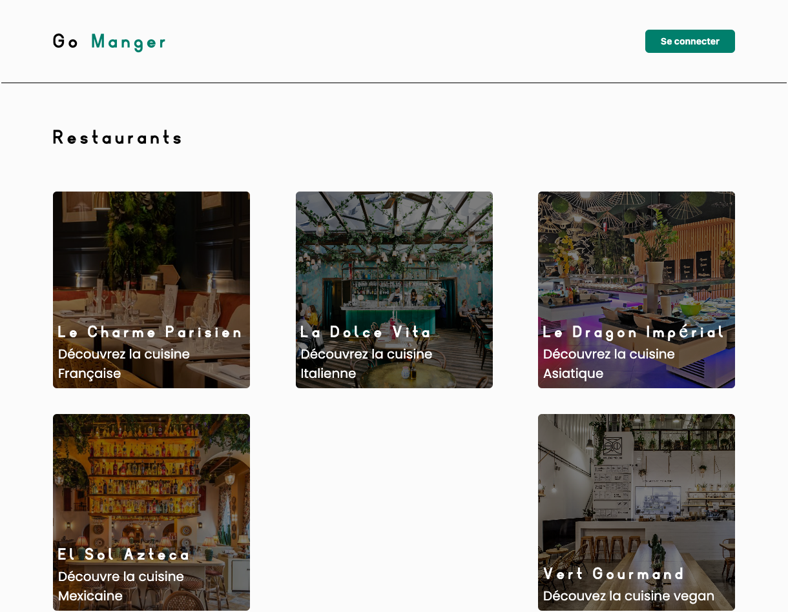

<h1 align="center">Go Manger</h1>
<p align="center">
  School Project
</p>

<p align="center">
  <a href="#introduction"><strong>Introduction</strong></a> ·
  <a href="#setting-up-locally"><strong>Setting Up Locally</strong></a> ·
  <a href="#tech-stack"><strong>Tech Stack</strong></a> .
  <a href="#routes"><strong>Routes</strong></a>
</p>
<br/>

## Introduction

Go Manger is an innovative solution to connect gourmets and restaurants in an unprecedented culinary experience. Our school project, much more than a simple digital food court, is an integrated platform allowing users to easily order from their favorite restaurants, while offering culinary establishments a powerful tool to manage orders and communications efficiently.

Cutting-Edge Features:

**Simplified Online Ordering:** Customers can browse menus, place an order and pay in just a few clicks.<br>
**Real-Time Tracking:** Restaurants update order status, informing customers of the ideal time for pickup.<br>
**Complete Administrator Area:** A dedicated interface to monitor and administer interactions between all users of the platform.

## Setting Up Locally

To configure Go Manger locally, you will need to clone the repository and configure the following environment variables (in the .env file):

```
DB_HOST="database"
DB_PORT="5432"
DB_USER="root"
DB_PASSWORD="root"
DB_NAME="postgres"

SECRET="secret"

SMTP_EMAIL="your_email@gmail.com"
SMTP_EMAIL_PASSWORD="your_password"
```

To test they routes without going to the front, open the collections file with [Bruno](https://www.usebruno.com/), and configure env (this does not include SSE routes and routes that upload an image):

`jwt` Your token if you are connected

To run the app locally, you can run the following commands:

```
make i (for install front-end dependency)
make dev (for start front-end and back-end with Docker)
```

## Tech Stack

Go Manger is built on the following stack:

**Back End:**
- [GO](https://go.dev/) - Programming Language
- [GOFiber](https://gofiber.io/) - Framework
- [GORM](https://gorm.io/) - ORM

**Front End:**
- [TypeScript](https://www.typescriptlang.org/) - Programming Language
- [React](https://fr.react.dev/) - JavaScript Library
- [Vite](https://vitejs.dev/) - Build Tool
- [Tanstack Router](https://tanstack.com/router/v1) – Routing
- [Tanstack Query](https://tanstack.com/query/latest) - Query Management
- [Ky](https://github.com/sindresorhus/ky) - fetching Library
- [TailwindCSS](https://tailwindcss.com/) – CSS Framework
- [Shadcn/ui](https://ui.shadcn.com/) UI Components
- [React Hook Form](https://react-hook-form.com/) - Forms management
- [Zod](https://zod.dev/) - Schema validation

**Database:**
- [PostgresSQL](https://www.postgresql.org/) - Relational Database

**Infrastructure & Deployment:**
- [Docker](https://www.docker.com/) - Containerize

## Routes

Base URL: [http://localhost:8080](http://localhost:8080)

*for example replaced id with 1*

**Public Routes:**

`/` Shows the list of all restaurants<br>
`/restaurant/id` Displays a restaurant and its menu, you can also order if you are authenticated as a customer<br>
`/signin` Allows users to login or register, restaurants to login and admins to login

**Customer Routes:**

`/client/order` Displays the details of an order placed by the customer, it is possible to click on an order to see its details<br>
`/client/order/id` Displays the details of an order<br>
`/client/profile` Allows you to see the customer's information, it is also possible to update your profile, log out or delete your account<br>
`/client/profile/update` Allows you to update the desired information

**Restaurant Routes:**

`/restaurant/order` Shows all orders, allows you to see the details or indicate if "accepted" or "refused", if accept then you can indicate that the order is "finish" then that the order is "recovered"<br>
`/restaurant/order/id` Displays the details of an order<br>
`/restaurant/menu` Shows the list of all menu items and the possibility of adding, update and delete item<br>
`/restaurant/menu/add` Created menu item<br>
`restaurant/update/id` Allows you to update the desired information for item<br>
`restaurant/profile` Allows you to see the restaurant's information, it is also possible to update your profile, log out or delete your account<br>
`restaurant/profile/update` Allows you to update the desired information

**Admin Routes:**

`/admin` Shows all orders, allows you to see the details or indicate if "accepted" or "refused", if accept then you can indicate that the order is "finish" then that the order is "recovered"<br>
`/admin/id` Displays the details of an order<br>
`/admin/restaurant` Shows the list of all restaurants and the possibility of adding a restaurant<br>
`/admin/restaurant/add` Adding a restaurant<br>
`/admin/restaurant/id` Displays the details of an order with menu, update and delete button<br>
`/admin/restaurant/id` Allows you to update the desired information<br>
`/admin/clients` Shows the list of all customers<br>
`/admin/user/id` Allows you to see the customer's information and his orders, it is also possible to update or delete account<br>
`/admin/user/update/id` Allows to update the customer<br>
`/admin/registerAdmin` Created admin account<br>
`/admin/profile` Allows you to see the admin's information, it is also possible to update your profile or log out your account<br>
`/admin/profile/update` Allows you to update the desired information for your account